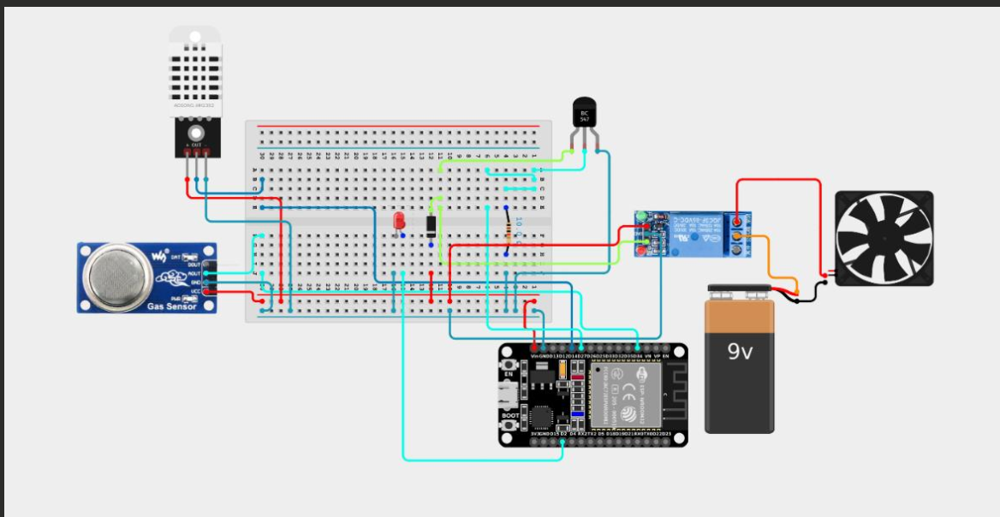

#  IoT-Based Gas Leak Detection System

An affordable, ESP32-powered gas leak detection system that monitors LPG/gas levels in real time, automatically cuts power and activates an exhaust fan when a leak is detected, and alerts users instantly via WhatsApp — while logging live data to the Blynk IoT cloud.

Built as part of **CC4003NI – Introduction to Robotics and IoT** at Islington College (London Metropolitan University), Autumn 2023.

---

##  Table of Contents

- [Overview](#-overview)
- [Features](#-features)
- [Hardware Architecture](#-hardware-architecture)
- [Components Used](#-components-used)
- [System Flow](#-system-flow)
- [Wiring / Circuit](#-wiring--circuit)
- [Software Setup](#-software-setup)
- [Getting Started](#-getting-started)
- [Test Results](#-test-results)
- [Future Work](#-future-work)
- [Ethical & Legal Considerations](#-ethical--legal-considerations)
- [Team](#-team)
- [References](#-references)
- [License](#-license)

---

##  Overview

Gas leaks — from LPG, propane, butane, or methane — are a leading cause of fires, explosions, and health hazards in homes and small industries, especially in regions like Nepal where LPG usage has grown faster than the safety infrastructure around it. Traditional detection relies on human smell, which fails when people are asleep, away, or simply inattentive.

This project builds a low-cost, real-time gas monitoring system around the **ESP32** microcontroller that:

1. Continuously reads gas concentration (MQ-6) and ambient temperature/humidity (DHT11/DHT22).
2. Compares readings against a safety threshold.
3. Automatically cuts power to ignition-risk devices and switches on an exhaust fan when a leak is detected.
4. Sends an instant WhatsApp alert via Twilio.
5. Streams live sensor data to the Blynk IoT dashboard for remote monitoring.

##  Features

-  Real-time gas concentration monitoring using the MQ-6 sensor
-  Ambient temperature & humidity logging via DHT11/DHT22
-  Automatic relay-controlled power cutoff on leak detection
-  Automatic exhaust fan activation to disperse accumulated gas
-  Instant WhatsApp alerts via Twilio API
-  Live remote monitoring through the Blynk IoT platform
-  Built entirely from low-cost, off-the-shelf components

##  Hardware Architecture

```
        DHT22                          MQ-6
    (Temp/Humidity)                (Gas Sensor)
          │                             │
          └───────────┬─────────────────┘
                       │
                    ESP32
                (Control Brain)
                       │
          ┌────────────┴────────────┐
          │                         │
     Relay Module              DC Motor (Fan)
   (Power Cutoff)             (Ventilation)
```

The ESP32 continuously reads analog data from the MQ-6 gas sensor and digital data from the DHT sensor, compares it against a set threshold, and drives the relay and fan accordingly — while simultaneously pushing data to the Blynk cloud and triggering WhatsApp alerts via Twilio.

##  Components Used

**Hardware**
| Component | Purpose |
|---|---|
| ESP32 Development Board | Central microcontroller / Wi-Fi |
| MQ-6 Gas Sensor | LPG / propane / butane detection |
| DHT11 / DHT22 Sensor | Temperature & humidity monitoring |
| 1-Channel Relay Module | Power cutoff switch |
| NPN Transistor | Drives 5V relay from 3.3V GPIO |
| Flyback Diode | Protects circuit from relay voltage spikes |
| DC Motor | Simulates an exhaust fan |
| 9V Battery | Power for the fan/relay side |
| Breadboard & Jumper Wires | Prototyping |

**Software**
- Arduino IDE (ESP32 board package)
- Blynk IoT platform (template: *Gas Safety*)
- DHT sensor library
- BlynkSimpleEsp32 library
- Twilio API (WhatsApp alerting)

##  System Flow

```
        ┌────────┐
        │  Start │
        └───┬────┘
            ▼
  Read MQ-6 (gas level) +
     DHT (temp/humidity)
            ▼
   Gas level > Threshold? ──No──► LED stays ON, Fan stays OFF
            │
           Yes
            ▼
  LED OFF · Fan ON · Send WhatsApp Alert
            │
            ▼
     Push readings to Blynk
            │
            ▼
      Wait 2 seconds ──► loop back
```

##  Wiring / Circuit

| Signal | ESP32 Pin |
|---|---|
| DHT sensor DATA | GPIO 14 |
| MQ-6 Analog Output | GPIO 34 |
| Relay Signal (IN) | GPIO 27 |
| Onboard status LED | GPIO 2 |


**Relay driver stage:** because the ESP32's 3.3V GPIO can't source enough current for a 5V relay coil directly, an NPN transistor is used as a switch (Base ← GPIO 27, Collector ← Relay IN, Emitter ← GND), with a flyback diode across the relay coil to absorb voltage spikes when it de-energizes.

**Fan stage:** the DC motor is wired through the relay's NO/COM contacts to a 9V battery, so the ESP32 never switches the fan's power directly.

> Add your own circuit diagram image (e.g. `docs/circuit-diagram.png`) and breadboard photos to a `docs/` or `images/` folder and reference them here for a stronger visual showcase.

##  Software Setup

1. Install the [Arduino IDE](https://www.arduino.cc/en/software) and add ESP32 board support.
2. Install these libraries via Library Manager:
   - `DHT sensor library` (Adafruit)
   - `Blynk` (BlynkSimpleEsp32)
3. Create a Blynk template (`Gas Safety`) and note your **Template ID**, **Template Name**, and **Auth Token**.
4. Set up a [Twilio](https://www.twilio.com/) account with WhatsApp sandbox access for alerting.
5. Copy `src/gas_leak_detection.ino` and fill in your own credentials (see below).

##  Getting Started

1. Clone this repository:
   ```bash
   git clone https://github.com/<your-username>/gas-leak-detection-system.git
   ```
2. Open `src/gas_leak_detection.ino` in the Arduino IDE.
3. Replace the placeholder values at the top of the file with your own:
   - `BLYNK_TEMPLATE_ID`, `BLYNK_TEMPLATE_NAME`, `BLYNK_AUTH_TOKEN`
   - Wi-Fi `ssid` / `password`
   - Twilio `account_sid`, `auth_token`, `from` / `to` WhatsApp numbers

   > ⚠️ **Never commit real credentials.** Use a `secrets.h` file (excluded via `.gitignore`) or environment-specific config for anything you actually deploy.
4. Wire up the hardware as described above.
5. Upload the sketch to your ESP32 and open the Serial Monitor at 9600 baud to confirm readings.
6. Open the Blynk app to view live data on your dashboard.

##  Test Results

| # | Objective | Result |
|---|---|---|
| 1 | Detect gas leakage using MQ-6 | ✅ Passed |
| 2 | Read temperature & humidity via DHT11 | ✅ Passed |
| 3 | Auto-activate exhaust fan on leak |  ✅ Passed |
| 4 | Send WhatsApp alert via Twilio | ✅ Passed |

**Root cause of Test 3 failure:** the DC fan motor needed more current than the relay/transistor stage could reliably supply. The fix identified is adding a dedicated motor driver (e.g. an **L298N** module) between the relay and the fan.

##  Ethical & Legal Considerations

This system is designed with life-safety and accessibility in mind — providing an affordable alternative to commercial gas safety products for households that might otherwise go without one. Any real-world deployment should consider:

- Compliance with local safety equipment standards (in Nepal, the Nepal Bureau of Standards and Metrology)
- Transparency with users about what sensor data is collected, stored, and shared via third-party cloud/messaging platforms (Blynk, Twilio/WhatsApp)
- Data privacy practices consistent with each platform's terms of service


c. (2026) *Blynk IoT Platform Documentation*.

## License

This project is licensed under the [MIT License](LICENSE).
